# Morphoblend

**Morphoblend** is an add-on for `Blender` for the import, processing, editing, quantification, rendering and export of cellular meshes derived from light microscopy data.

**MorphoBlend** has been designed as a companion to **PlantSeg** (see PlantSeg on [GitHub](https://github.com/hci-unihd/plant-seg) and the [publication](https://elifesciences.org/articles/57613)) a tool for cell instance  segmentation in densely packed 3D volumetric images of plant tissues. Together with **seg2mesh** (see seg2mesh on [GitHub](https://github.com/lorenzocerrone/python-seg2mesh)), it alows to visualise, process, edit and quantify cells in tissues:

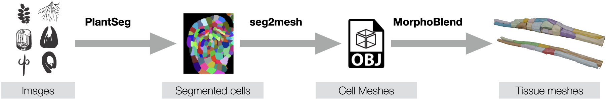

**MorphoBlend** can also be used for cell meshes generated by other modalities.

## Features

- `Blender` add on.
- Import cell meshes in `PLY` format.
- Can efficiently handle thousands of cells.
- Built in tools for processing (coloring, renaming, filtering, sorting).
- Merging and splitting of cells.
- Easy navigation through time series
- Quantification, visualisation and export of cell attributes (volume, area, ...).
- Assign root tissues
- Tracking of cells
- Extraction of 3D connectivity graph.
- ... more to come :-).

## Release notes

##### v0.5.2 | Headless mode for 3D connectivity graph [2021-04-26]

- Headless extraction of the 3D connectivity graph of cells from the command line

##### v0.5.1 | Basic export  and misc. improvements [2020-11-22]

- Basic export of each cell as `PLY` 
- Improved performances of headless importer
- Improved performances of Filtering based on volume: implemented caching to speed up repeated filtering.

##### v0.5.0 | Cell tracking and 3D connectivity graph [2020-10-16]

- Basic tracking of cells over time to establish lineages
- Extraction of the 3D connectivity graph of cells
- Code cleanup, bug fixing and misc. improvement

##### v0.4.0 | Assign root tissues & headless import [2020-09-21]

- Assign radial root tissues (layers)
- Set visibility of groups of tissues
- Headless import: it is now possible to import PLY files directly from the command line.
- Voxel dimensions (*x* and *y*) are now set from the magnification.

##### v0.3.5 | Time point navigation [2020-09-04]

- Navigate through time points using the keyboard.
- Clear the *Filter results* collection (without deleting the objects!).
- Improved readability and style of code.

##### v0.3.4 | Filter cells based on volume [2020-08-14]

Cells which volume is in a given range are selected and listed (as aliases) in a *Filter results* collection. Works on a selection or on *all* cells of the scene (visible or not).

##### v0.3.3 | Bulk color cells in collection [2020-08-12]

 All cells present in a collection matching a given pattern (`regex`-style) can be colored.

##### v0.3.2 | Bug fixes [2020-08-10]

##### v0.3.1 | Bug fixes & improvements [2020-08-07]

Fixed (nasty) bug affecting the volume computation.
Colorize cells according to volume or area.

##### v0.3.0 | Splitting and merging [2020-08-07]

Cells can be split and merged interactively. Cells to be processed can be added/removed from the `Work List` which can be navigated.

##### v0.2.0 | Quantification and visualisation [2020-08-01]

Quantification of cell volumes & area.

##### v0.1.0 | Initial release [2019-12-18]

Import and Process modules implemented.

## Requirements

- `Blender v3.6.x LTS`: [download](https://www.blender.org/download/lts/).
- A basic understanding of Blender. See [this series of videos to get started](https://www.youtube.com/playlist?list=PLa1F2ddGya_-UvuAqHAksYnB0qL9yWDO6).

## Installation

**MorphoBlend** installs as any other `Blender` addon.

- Download **Morphoblend** as a `zip` file.

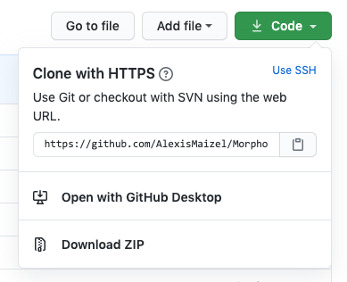

- Open `Blender`.
- Install the addon as [described here](https://docs.blender.org/manual/en/latest/editors/preferences/addons.html).

## Gallery

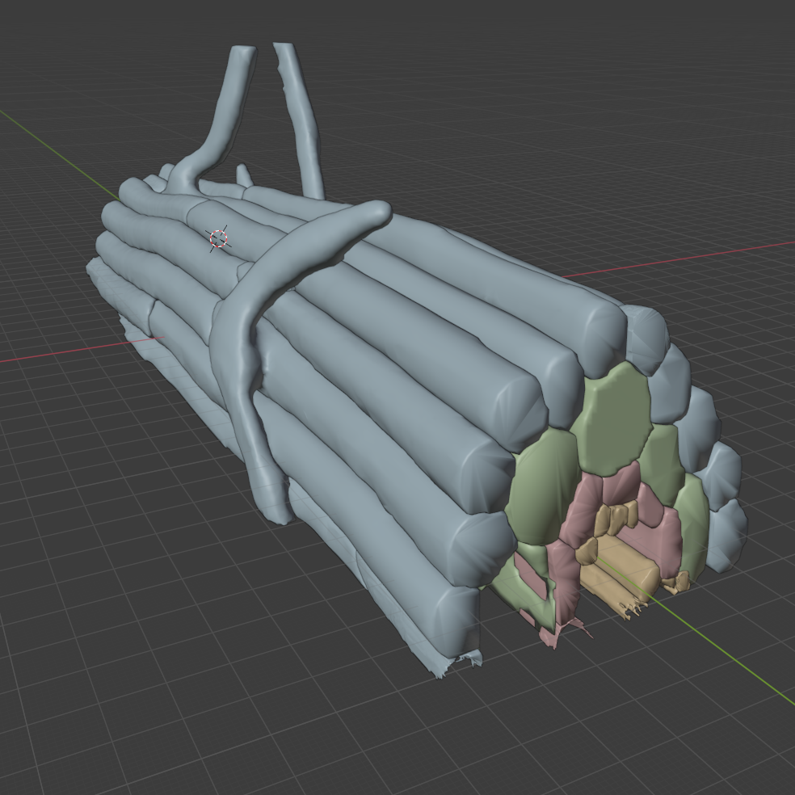
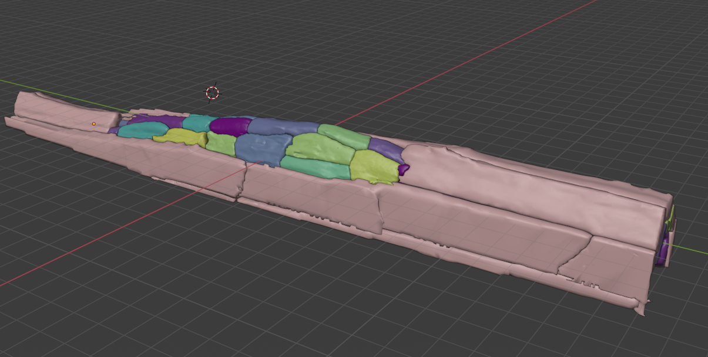
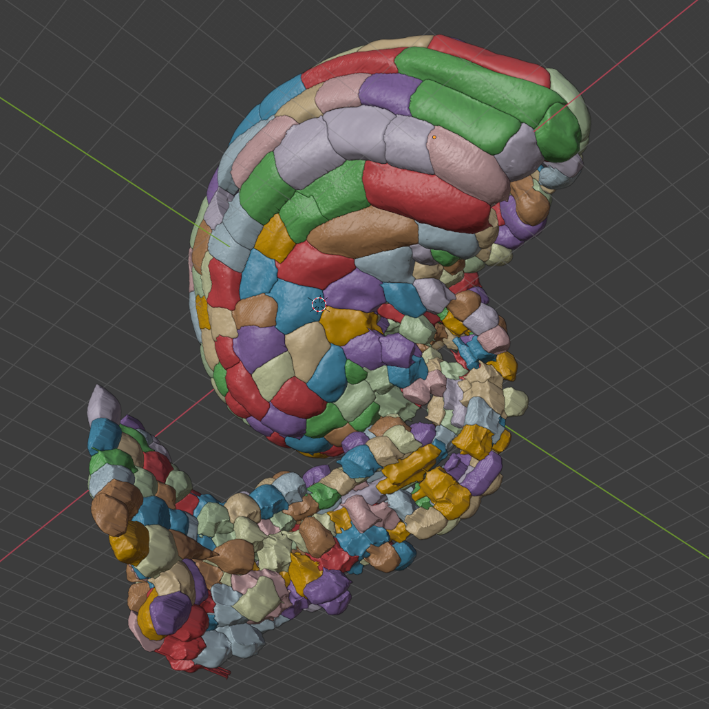
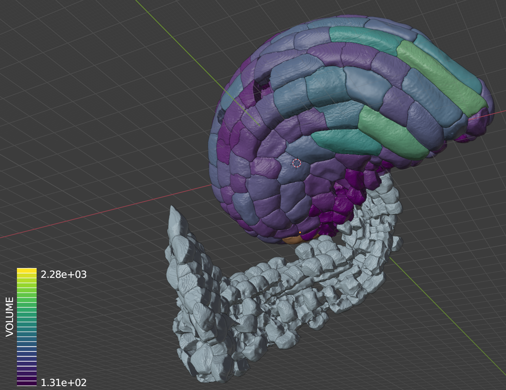

## Acknowledgments

The following people have actively contributed to the development, improvement or test of **MorphoBlend**:

- Sami Bouziri

## Using MorphoBlend

**MorphoBlend** is available as a tab on the right side of Blender's main 3D viewport.
It consists of several modules:

- Import
- Process
- Alter
- Analyze
- Quantify
- Render
- Export

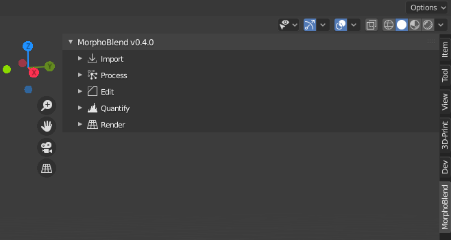

### Keyboard shortcuts

- Navigate through time points:
Mouse pointer *must* be in main window and time points *must* be collections starting with `t` or `T` followed by digits only (*e.g.* `t42` or `T123`):
  - `Ctrl + Shift + Down_arrow`: **next** time point
  - `Ctrl + Shift + Up_arrow`: **previous** time point

### Import

This module handles import of the cells mesh and their immediate post-processing.

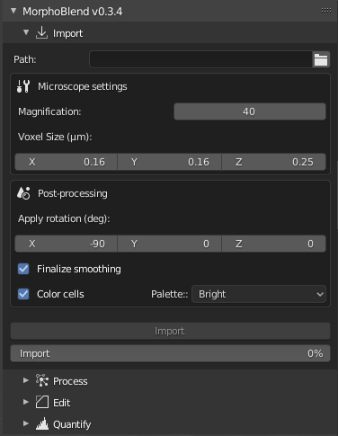

**Path:** Type or select (click on `folder` icon) a folder containing the files to import. Only files in  `PLY` format can be imported. The importer will import:

- all files in the folder which end by `.ply`

- all `ply` files contained in sub-folders of the main folder as long as this is named `tXX` (*eg* t03). This allows the automatic import of whole time series.

```python
\Folder:
  |---> file1.ply               <- will be imported
  |---> file2.txt               <- will NOT be imported
  |---> \t00
  |       |---> file3.txt       <- will NOT be imported
  |       |---> file4.ply       <- will be imported
  |       |       (...)
  |       |---> file6.ply       <- will be imported
  |
  |---> \t01
          |---> file7.ply       <- will be imported
          |---> file8.ply       <- will be imported
```

Files located in a subfolder will be automatically placed in a sub-collection of the same name, while all other files will be put in the `Imported` collection.

**Microscope settings:**

- **Magnification**: magnification of the lense used during imaging.

- **Camera pixel size**: physical dimensions of the camera pixel (default is 6.5µm).

- **Voxel size**: physical dimensions of the voxel in µm. *X* and *Y* values are either computed from the camera pixel size and the magnification used or can be entered manually. This controls the anisotropic scaling of the meshes and all calculations (volume, area, dimensions...).

**Post-processing:**

- **Apply rotation**: define the rotation (in degrees) along the X, Y & Z axis apply to all meshes after import. Useful to correct for swaps in the orientation of axis.

- **Finalize smoothing**: whether all cells are remeshed and decimated to keep their aspects correct and reduce the number of triangle. Beware: not ticking this box can result in **large** files.

- **Color cells**:  to assign or not a color at random from the selected **palette**.

**Import:** Pressing this button will start the import process. The bar indicates progress. **(!)** Check *known bug section*.

**Translate to origin:** Pressing this button will translate *all* objects so that they are centered onto the scene origin.

#### Importing files from the command line (headless import)

The import function is relatively slow. If you have large numbers of objects to import, it is recommended to import the `PLY` files into a new file directly from the command line (without `Blender`'s GUI). This speeds up the process drastically, especially on machines with several cores.

To do so, you need to launch `Blender` from a terminal in the so called *background* or *headless* mode and use the script `import_headless.py` which can be [downloaded here](import_headless.py):

```python
blender -b -P import_headless.py -- --path ~/Desktop/Jaz_test_ply --voxel 0.250 0.1083 0.1083 --rotation O O O
```

The `-b` option tells `Blender` to run in the background,  `-P` the path to the script to execute, and everything beyond `--` are the script arguments.

There are three mandatory arguments:

- `--path`: the path to the folder containing the `ply` files to import
- `--voxel`: the Voxel dimensions in µm (x/y/z)
- `--rotation`: Rotation to apply to each axis in deg (x/y/z)

See [this page](https://caretdashcaret.com/2015/05/19/how-to-run-blender-headless-from-the-command-line-without-the-gui/) for instructions on how to retrieve the path to `Blender` on your machine.

**Good to know**:

- the resulting `Blender` file is named  `Output.blend` and saved at the location passed to `--path`
- the project is automatically saved after import of all files in a time point folder (`tXX` or `Txx`) has completed
- progresses of the import are logged in `Output.log`


### Process

This modules handles the selection, colouring, sorting and filtering of the cells.

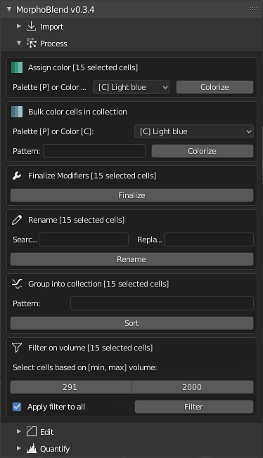

**Assing color:** assign to a selection of cells either a specific color (prefix `[C]`) or a color at random in a palette (prefix `[P]`). In the latter case, pressing `Color` several times shuffle the color assignment, which is interesting when neighbouring cells have similar colors.

You can also color all cells in collection(s) matching the term on the pull down menu. Then press `Color all`  are assigned a specific color or colored randomely from the chosen palette.

**Rename:** will rename all selected objects. `regex`-style expression can be used in the search and replace fields. `Replace all` will do this for all cells, also the hidden ones.

**Group into collection:** will move all objects which name fit the `regex`-style expression, to a collection of the same name.

**Filter on volume:** Cells which volume is in a given range are selected and listed (as *aliases*) in a *Filter results* collection. When `Apply filter to all` is ticked,  the filtering is applied to *all* cells of the scene (visible or not, selected or not).

### Alter

This module handles the modification of the cell meshes.

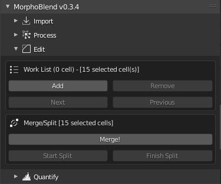

There are keyboard shortcuts to call the functions; hover the mouse over the button to reveal them.

**Work List:** The work list is a special collection that stores references to cells that need to be merged or split. Selected cells can be added/removed by pressing the corresponding buttons. Navigate in the list with the next/previous buttons. Important: cells in the Work List are *aliases* (or links) of the original cells, that remain in their original collection. Removing a cell from the working list does not remove it from its collection nor erase it.

**Merge:** This merges two or more selected contiguous cells in a single mesh.

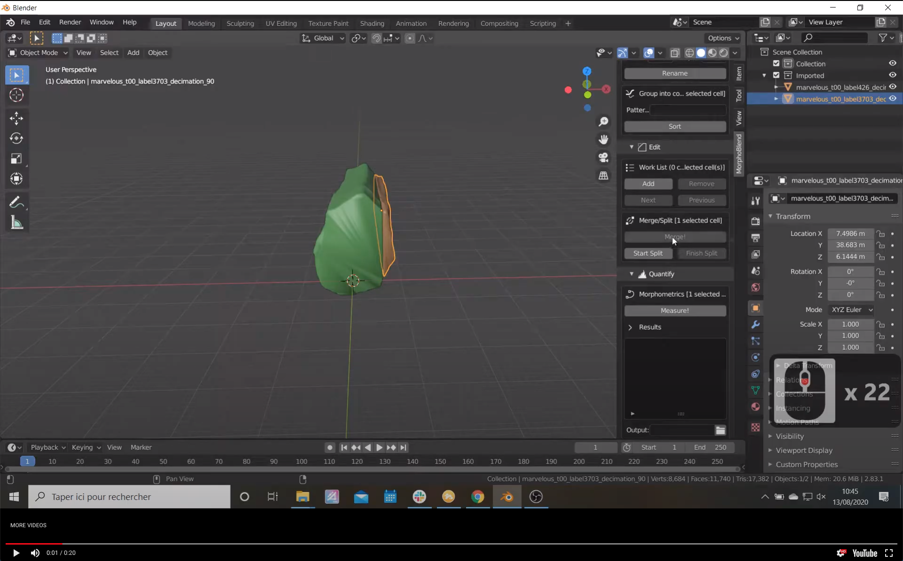

[Link to video](https://youtu.be/mK8IlsS0CT0)

**Split:** This splits a single cell. This is a two steps, semi automatic process:

- **Phase 1 - Cutting the cells**:
    1. Press the `Start split` button this will activate the mesh edit mode  **just for the cell to split**. No need to worry about the other cells around, they can't be edited.
    2. Using the `KNIFE` or `BISECT` tools (located on the left tool bar), delineated a plan (`BISECT` tool) or a path (`KNIFE` tool) on the mesh along which the cells will be cut.
    3. Press `ENTER`
    4. Press `V` to rip the mesh apart. Do ***not*** touch the mouse, use the keybaord arrows to move the cut a little (3-4 keystrokes are sufficient).
    5. Press `ENTER`.

- **Phase 2 - Finalise the split** Press the `Finish Split`. The split cells will be separated in two new cells and their names updated.

**Demos:**

Spliting with `BISECT`

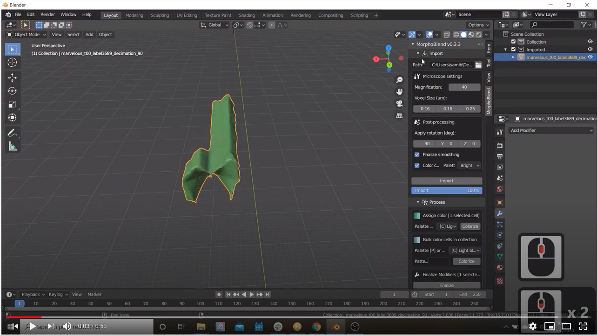

[Link to video](https://youtu.be/IbCE5WAFq94)

Spliting with `KNIFE`

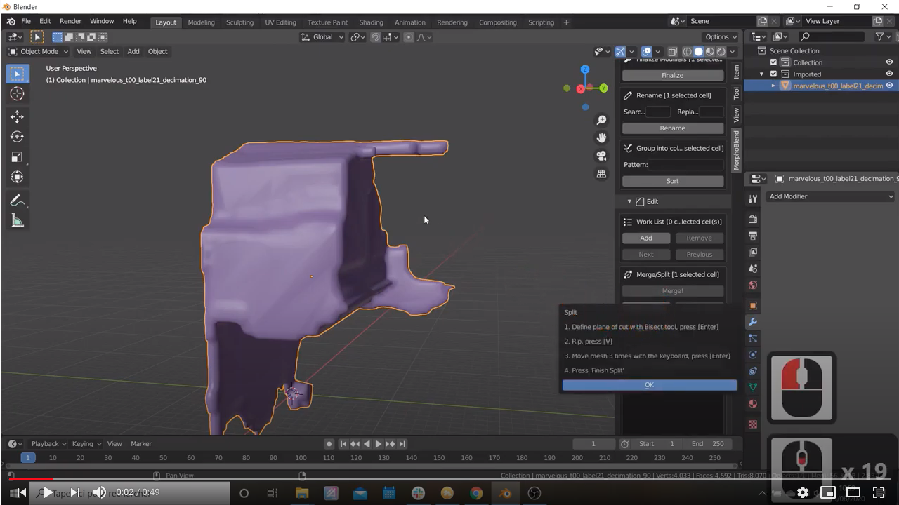

[Link to video](https://youtu.be/cxdl3-XK8Rg)

### Analyze

This module handles analyses on cells in tissues.

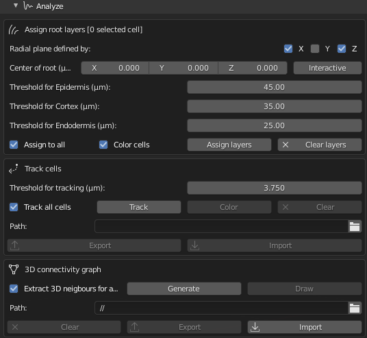

**Assign root layers:** This will assign *Epidermis*, *Cortex*, *Endodermis* and *Stele* identity based on the radial distance from the center of the root.
For this you must:

- define the radial plane by ticking the appropriate boxes.
- Indicate the position of the root center. You can enter the values directly in the *X/Y/Z* fields **OR** position it interactively by pressing the **'Interactive'** button.
- define how far from the center the Endodermis, Cortex and Epidermis are located.
- You can assign layers only to the selected cells or to *all* cells (visible or not) by ticking **'Assign to all'**
- You can assign a color to all cells in the layers by ticking **'Color cells'**
- Layers are assigned after you press **'Assign layers'**.
- Assignements can be cleared by pressing **'Clear layers'**.

**Demo:**

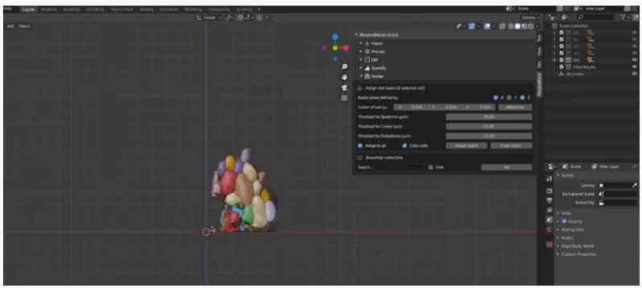

[Link to video](https://youtu.be/E-JgUqVLHZM)

**Track cells:** This will attempt to track cells over time by closest proximity. This is relatively crude but produces decent results for non dividing, non swelling cells.

The sole parameter to tune is the `Threshold for tracking`: the higher the value the more tolerant.

- Ticking `Track all cells` will track every single cells, not just the selected ones.
- Press `Track` to start the tracking process.
- Once  tracking data exist, pressing `Color` will assign a unique color to each lineage
- To erase the track data, click `Clear`.

The tracking data can  be exported / imported:

- select the path
- press `Import` or `Export`

**3D connectivity graph:** This will generate the graph of cell connectivity: adjacent cells are nodes linked by an edge.
Note: the area of contact between two cells is stored as an  edge attribute.

- Ticking `Extract for all cells` will generate the graph of cell connectivity for  every single cells, not just the selected ones.
- Press `Generate` to start the process. (!) **Beware** this can be long! Consider the headless version if mny points needs to be processed.
- Once  tracking data exist, pressing `Draw` to visualise the resulting graph
- To erase the track data, click `Clear`.

The connectivity data can  be exported / imported in `JSON`:

- select the path
- press `Import` or `Export`


**Generating 3D connectivity graph in headless mode:**

Generating 3D connectivity graph  can be very slow. If you have many to generate, it is recommended to  generate them directly from the command line (without `Blender`'s GUI). This speeds up the process drastically, especially on machines with several cores.

To do so, you need to launch `Blender` from a terminal in the so called *background* or *headless* mode and use the script `rag_headless.py` which can be [downloaded here](rag_headless.py):

```python
blender -b -P rag_headless.py -- --path input_file.blend --timepoints 02 05 07
```

There is one mandatory argument:

- `--path`: Path to the Blender file to process

There is one optional argument:

- `--timepoints`:  list of time points to process. Example 00 15 62.  If omitted **all** time points are processed

See [this page](https://caretdashcaret.com/2015/05/19/how-to-run-blender-headless-from-the-command-line-without-the-gui/) for instructions on how to retrieve the path to `Blender` on your machine.


### Quantify

This module handles all quantifications on cells.

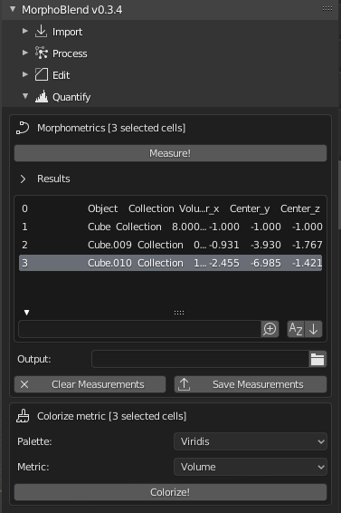

**Morphometrics:** this computes several metrics on the selected cells. The results are displayed in a table, that can be searched, sorted, cleared and saved to disk as `.CSV` file. For the latter, type or set the path to the output file by pressing the  folder icon.
The output file will contain in addition to the name of the cell and the collections in belongs to, the following metrics:

- Volume (in µm3)
- Area of (in µm2)
- Dimensions along the *X*, *Y* and *Z* axis
- Coordinates of center (*X, Y, Z*)

**Colorize metric:** the selected cells will be coloured according to their *Volume* or *Area*, using the full range of the selected palette. A lookup table is displayed.

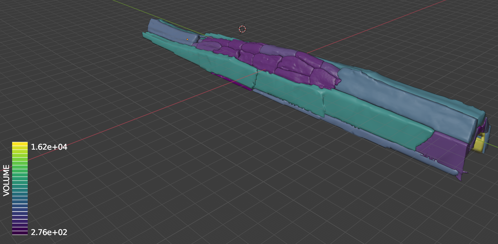

### Render

This modules contains tools to arrange and visualise cells and tissues.

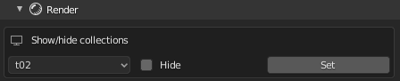

**Show/hide collections:** This will set the visibility of *any collection* which names matches the string in **'Search'**(regex accepted!). Press **'Set'** to execute. This is very useful to toggle th visibility of tissues accross all time points.

### Export

Not yet implemented.

## Known bugs & limitations

**Import**: The very first import after (re)starting Blender usually skips the first file. Erasing the cells, and repeating the import solves the issue.

**Quantify: colorize metric**: the lookup table remains in the 3D viewport until `Blender` is quit & relaunched.
